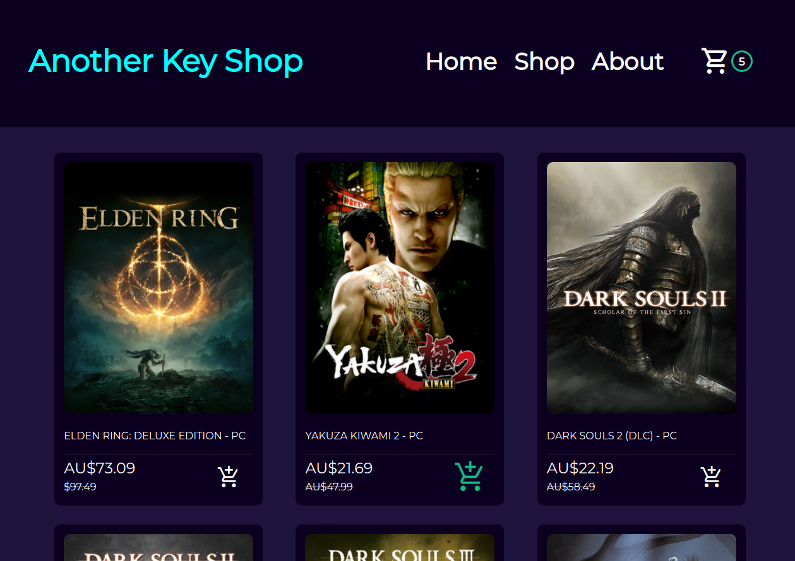

# Shopping Cart: an e-commerce shopping cart demo
A fully responsive e-commerce game key shop, built using React, TypeScript and CSS.
## [Live Link 👈](https://shopping-cart-2pca8zh3r-waldorfio.vercel.app/)

### Features
- Browse through a fully responsive e-commerce shop
- Add your favorite steam games to a stateful shopping cart

### Goals
- Showcasing routing with react-routers through creation of a single-page application in React
- Practice implementing TypeScript with React
- Further refine CSS skills

### Challenges Faced
- Passing state through Outlet routes in Typescript
- Managing strict types via TypeScript
- Use and manipulate the DOM via hooks

## How to run the app
### 1. Click the [hosted link](https://shopping-cart-2pca8zh3r-waldorfio.vercel.app/)

OR

### 2. Host it locally
1.	Either fork or download the app and open the folder in the cli
2.	Install all dependencies using the `npm i` command
3.	Start the web server using the `npm run local` command. The app will be served at http://localhost:8080/
4.	Go to  http://localhost:8080/ in your browser, and start the app!

## How to use the app
1. Navigate to the store page
2. Add products to your cart!
3. ...and thats it! This app is just a demo to showcase routing with React (no backend implemented).

## Future Features
- Fix forbidden non-null assertions
- Add a backend to allow for user login, account management, and dummy checkout

## Dependencies